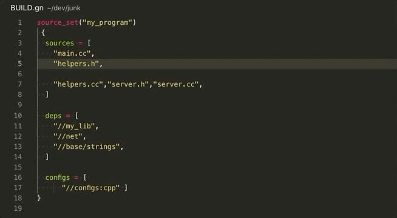

# GN Format for VSCode

Adds `Format Document` action in GN files. [GN](https://gn.googlesource.com/gn/+/master/docs/reference.md)
 is meta build system used in chromium developement.

### Usage:

1. Install extension
2. Setup path for `gn` utility if needed (`gnformat.path`). `gn` is used by default.
3. Use `⌘+shift+P` and `Format Document` action or `alt+shift+F`.
